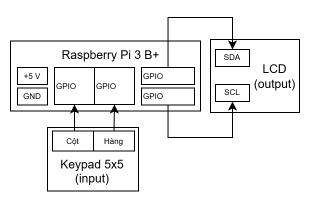
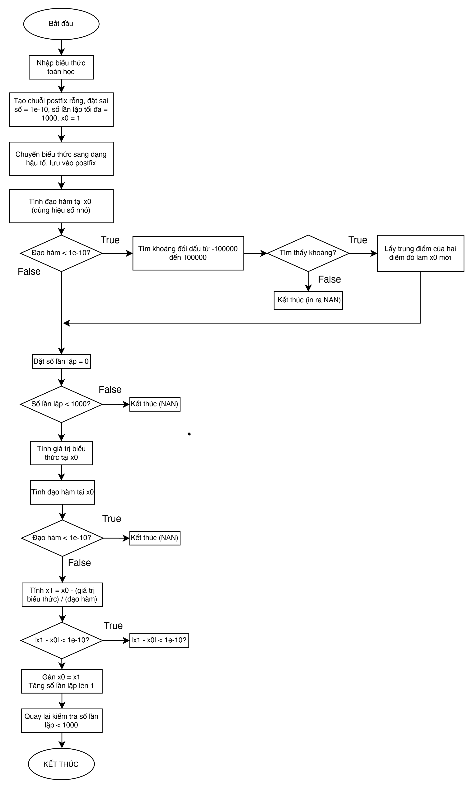
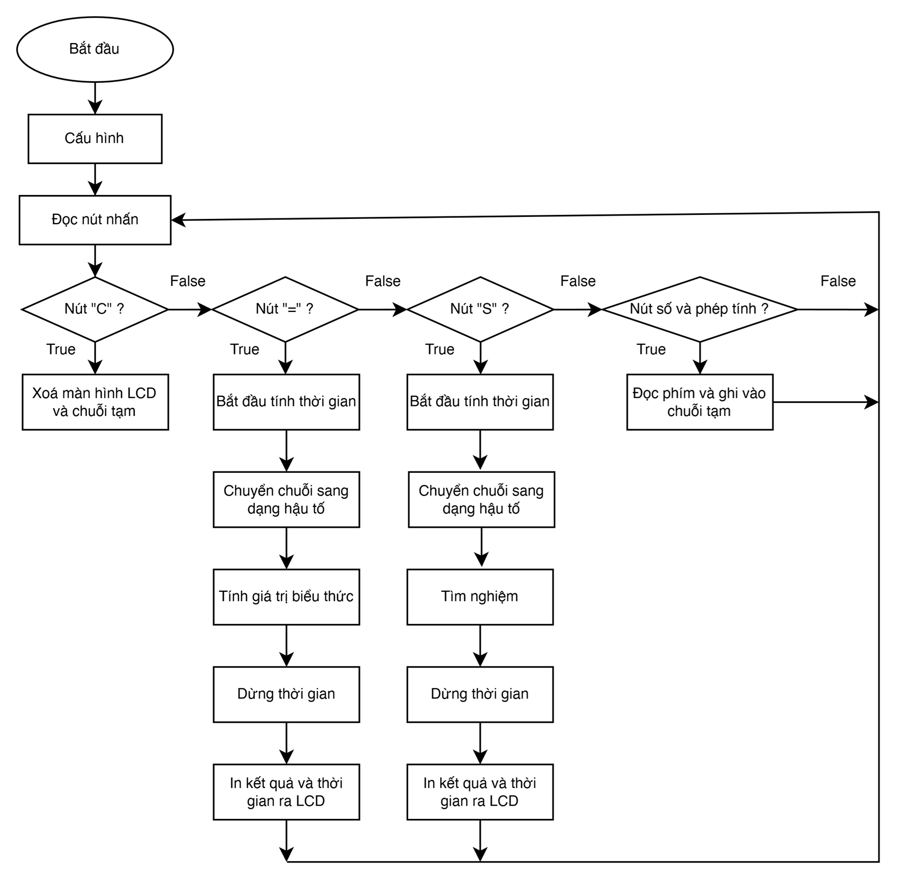

# **Numerical-solver-rpi-stm32** (Lập trình HT nhúng - Nhóm 1 L01)

[](https://opensource.org/licenses/MIT)

## Overview

This project, developed for the Embedded Systems Programming course at HCMUT, implements a scientific calculator and equation solver using a Raspberry Pi, a 5x5 matrix keypad for input, and a 16x2 character LCD for output. The system can evaluate complex mathematical expressions and find real roots of equations involving the variable 'x' using numerical methods. The code is modular, separated into different files for keypad handling, calculation logic, equation solving, and the main application loop.

**Development Workflow Note:** This project is developed and operated "headless" (without a dedicated monitor connected to the Raspberry Pi). Interaction, compilation, and execution are performed remotely via SSH, often using VS Code with the Remote - SSH extension.

## Features

*   **Expression Evaluation:** Evaluates mathematical expressions involving:
    *   Basic arithmetic operators: `+`, `-`, `*`, `/`
    *   Exponentiation: `^`
    *   Parentheses: `(` `)` for precedence control.
    *   Decimal numbers.
*   **Equation Solving:** Finds real roots of equations containing the variable `x` (e.g., `2*x^2 - 5*x + 2 = 0`) using a hybrid Newton-Raphson/Bisection approach.
*   **Input:** Uses a custom 5x5 matrix keypad.
    *   `=` key: Triggers expression evaluation.
    *   `S` key: Triggers equation solving (finding roots for 'x').
    *   `C` key: Clears the current input.
*   **Output:** Displays input expression/equation and calculated result/root on a 16x2 LCD.
*   **Accuracy:** Aims for high precision in calculations (results shown with appropriate significant figures).
*   **Performance:** Measures and displays the execution time for calculations/solving.

## Hardware Components

*   **Processing Unit:** Raspberry Pi 3 Model B+ (or similar)
    *   CPU: 1.4GHz 64-bit quad-core ARM Cortex-A53
    *   RAM: 1GB LPDDR2 SDRAM
*   **Input:** Custom 5x5 Matrix Keypad
*   **Output:** 16x2 Character LCD (1602A)
*   **Interfacing:**
    *   I2C Module for LCD (Recommended) or direct GPIO connection.
    *   Jumper Wires
    *   Breadboard (for prototyping)
*   **Power:** 5V Power Supply for Raspberry Pi

## Software & Dependencies

*   **Operating System:** Raspberry Pi OS (or any compatible Linux distribution)
*   **Language:** C
*   **Compiler:** GCC (GNU Compiler Collection)
*   **Core Source Files:**
  - `main.c`: Main application loop, initialization, LCD interaction logic
  - `keypad.c`: Handles keypad matrix scanning, debouncing, and character mapping
  - `calculator.c`: Implements expression parsing (infix to postfix) and evaluation logic
  - `solve.c`: Implements the numerical methods for equation solving (root finding)
  - Corresponding header files: `keypad.h`, `calculator.h`, `solve.h`
- **Libraries:**
  - `pigpio`: Essential for precise GPIO control (keypad scanning, direct LCD control if not using I2C). (http://abyz.me.uk/rpi/pigpio/)
  - Standard C libraries: `stdio.h`, `stdlib.h`, `string.h`, `ctype.h`, `math.h`, `time.h` (for `clock_gettime`)
- **Development Tools:**
  - SSH Client (e.g., PuTTY, OpenSSH)
  - VS Code (with Remote - SSH extension recommended) or any text editor

## System Design & Architecture

The system connects the keypad and LCD to the Raspberry Pi's GPIO pins. The software is structured modularly:

- `main.c`**:** Orchestrates the flow, reads processed key presses from `keypad.c`, calls functions in `calculator.c` or `solve.c` based on input (`=`, `S`), and displays results on the LCD

- `keypad.c`**:** Continuously scans the GPIO pins connected to the keypad matrix, handles debouncing, and translates detected key presses into characters or specific command codes

- `calculator.c`**:** Takes an infix expression string, converts it to postfix (Reverse Polish Notation) using stacks, and then evaluates the postfix expression to get the numerical result

- `solve.c`**:** Takes an expression string containing 'x', uses functions from `calculator.c` to evaluate the expression for given values of 'x' (`f(x)`), calculates the derivative (`f'(x)`) numerically, and applies the root-finding algorithm

*   **Keypad Connection (5x5 Matrix):**

  - Rows (Input, Pull-up): GPIO 4, 5, 6, 12, 26
  - Columns (Output): GPIO 7, 8, 9, 10, 11

*   **LCD Connection:**
    *   **Using I2C:** SDA (GPIO 2), SCL (GPIO 3) connected to the I2C module on the LCD.

**Block Diagram**


## Algorithms Used

- **Keypad Scanning (in** `keypad.c`**):** Iteratively sets columns LOW and reads rows to detect key presses. Debouncing is implemented using small delays or state tracking

- **LCD Interfacing (in** `main.c`**):** Sends commands and data according to the HD44780 protocol via direct GPIO manipulation using `pigpio`

- **Expression Evaluation (in** `calculator.c`**):** Uses the Shunting-yard algorithm to convert infix to postfix notation, followed by postfix evaluation using a stack

- **Equation Solving (in** `solve.c`**):**

  - **Root Bracketing:** Searches for an interval \[a, b\] where f(a) and f(b) have opposite signs
  - **Newton-Raphson Method:** Iteratively refines the root estimate: `x1 = x0 - f(x0) / f'(x0)`
  - **Numerical Differentiation:** Calculates `f'(x0)` using finite differences (e.g., `(f(x0 + h) - f(x0 - h)) / (2*h)` for a small `h`). `f(x)` evaluations reuse logic from `calculator.c`
  - **Hybrid Approach:** Uses bracketing to find an initial range, potentially bisection as a fallback if Newton-Raphson diverges or the derivative is too small

     *(Adjust path if needed)*
    *Figure: Flowchart detailing the hybrid root-finding algorithm.*

     *(Adjust path if needed)*
    *Figure: Flowchart illustrating the main program loop and user interaction.*

## Setup & Installation

1. **Hardware Setup:** Connect the keypad and LCD to the Raspberry Pi GPIO pins as defined in `keypad.h`
2. **Enable Interfaces (if needed):**
   - Use `sudo raspi-config` -&gt; Interfacing Options -&gt; Enable I2C (if using I2C LCD)
   - Enable SSH via `sudo raspi-config` if not already enabled
3. **Install Dependencies:** Open a terminal (locally or via SSH / VS Code integrated terminal) and run:

   ```bash
   sudo apt-get update
   sudo apt-get install pigpio
   ```
4. **Clone Repository:**

   ```bash
   git clone <your-repository-url>
   cd <your-repository-directory>
   ```
5. **Compile:** Navigate to the directory containing your source files (`main.c`, `keypad.c`, etc.) using the terminal (e.g., `cd src` if they are in a `src` folder) and run:

   ```bash
   gcc -Wall -o calculator main.c keypad.c calculator.c solve.c -lpigpio -lrt -lm
   ```
   - `-Wall`: Enable all compiler warnings (recommended)
   - `-o calculator`: Specify the output executable file name
   - `main.c keypad.c calculator.c solve.c`: Your source code files
   - `-lpigpio`: Link the pigpio library
   - `-lrt`: Link the real-time library (for high-resolution timers like `clock_gettime`)
   - `-lm`: Link the math library (for functions like `pow`, `fabs`, etc.)

## Usage

1.  **Connect via SSH (if using remotely):**
    ```bash
    ssh pi@<raspberrypi_ip_address>
    ```
2.  **Navigate to Executable Directory:** Change to the directory where you compiled the code and the `calculator` executable resides (e.g., `cd <your-repository-directory>/src`).
    ```bash
    cd /path/to/your/compiled/executable/
    ```
3.  **Run the Program:** The `pigpio` library typically requires root privileges for direct hardware access.
    ```bash
    sudo ./calculator
    ```
4.  **Interact:**
    *   Use the 5x5 keypad to enter numbers, operators (`+`, `-`, `*`, `/`, `^`), parentheses `(`, `)`, decimal point `.`, and the variable `x`.
    *   The input appears on the first line of the LCD.
    *   Press `=` to evaluate the expression. The result and execution time appear on the second line.
    *   Press `S` to solve the equation for `x`. The root found and execution time appear on the second line.
    *   Press `C` to clear the input and the LCD display.
5.  **Exit:** Press `Ctrl + C` in the terminal where the program is running.

## Limitations

*   **Single Root:** The `solve` function primarily targets finding one real root. It might not find all roots if multiple exist.
*   **LCD Size:** The 16x2 LCD limits the display length of inputs and outputs; long expressions/results might be truncated or require unimplemented scrolling.
*   **Numerical Stability:** Newton-Raphson can be sensitive to the initial guess and function behavior (e.g., near-zero derivatives).
*   **Function Support:** Limited to basic arithmetic, exponentiation, and parentheses. Does not support trigonometric, logarithmic, etc.
*   **Error Handling:** Input validation might be basic. Syntax errors or mathematical errors (like division by zero during evaluation) might lead to incorrect results or program crashes instead of clear error messages.

## Future Work

*   **Multi-Root Finding:** Enhance `solve.c` to search for and report multiple real roots within a specified range.
*   **Improved Display:** Implement text scrolling on the LCD for long inputs/outputs or consider using a larger display (e.g., 20x4 LCD).
*   **Advanced Functions:** Extend `calculator.c` and `keypad.c` to support trigonometric, logarithmic, and other scientific functions.
*   **Robust Error Handling:** Add more comprehensive input parsing and validation in `calculator.c` and `main.c` to catch syntax errors and mathematical issues, displaying user-friendly messages on the LCD.
*   **Algorithm Options:** Allow selection or automatic fallback to other numerical methods (Secant, Bisection) in `solve.c`.
*   **Code Refinement:** Add header files (`.h`) for better modularity and potentially refactor code for clarity and efficiency.

## License

This project is licensed under the MIT License - see the [LICENSE](LICENSE) file for details.